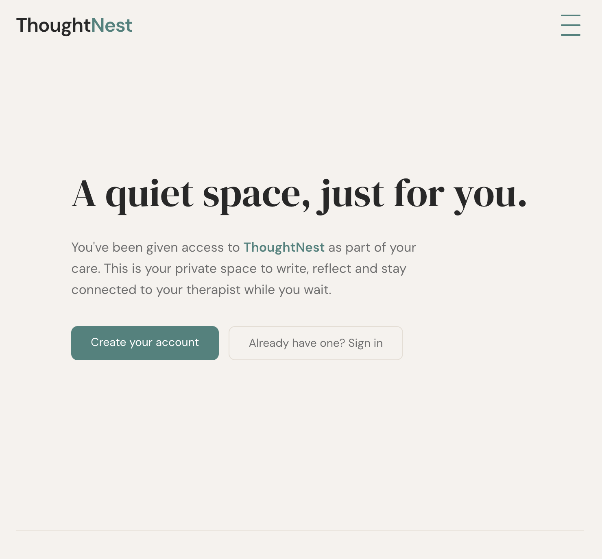
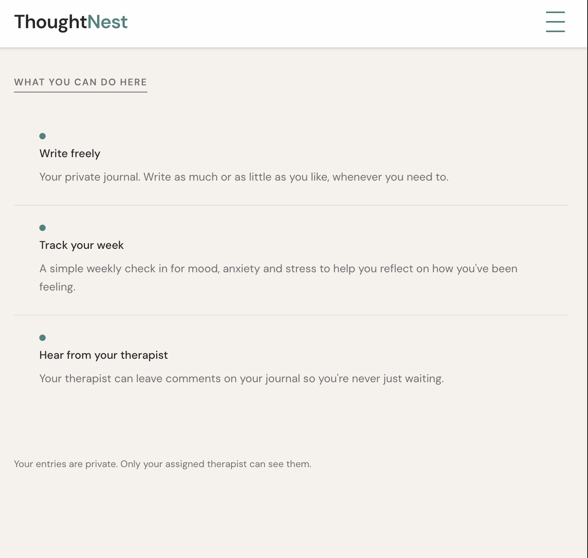
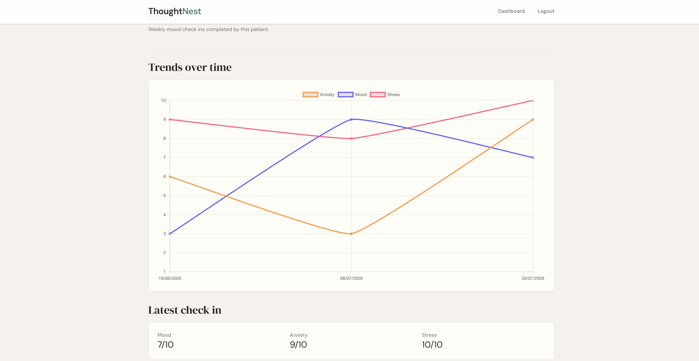

# ThoughtNest

ThoughtNest is a role based mental health journaling application built with Laravel.

It provides a private space for patients to record journal entries and weekly mood check ins while enabling therapists to offer supportive feedback. Administrators manage therapist accounts and patient assignments, ensuring therapists only have access to those in their care.

The project was built as a portfolio application to explore Laravel concepts including authentication, authorisation, policies, role based access control and building applications with multiple user workflows.

---

## Screenshots

### Homepage

### Therapist mood tracking

---

## Demo Accounts

The application includes seeded demo accounts for each role.

| Role      | Email                      | Password        |
| --------- | -------------------------- | --------------- |
| Admin     | admin@thoughtnest.demo     | ThoughtNest123! |
| Therapist | therapist@thoughtnest.demo | ThoughtNest123! |
| Patient   | patient@thoughtnest.demo   | ThoughtNest123! |

---

## Features

### Patient

- Secure registration and authentication.
- Create, edit and delete private journal entries.
- Complete weekly mood check ins.
- View supportive comments from their assigned therapist.
- Access restricted to their own data.

### Therapist

- View only patients assigned by an administrator.
- Read patient journal entries.
- View mood trends over time using interactive charts.
- Leave supportive comments on journal entries.
- Delete comments when required.
- Access enforced using Laravel policies.

### Administrator

- Register therapist accounts.
- Assign therapists to patients.
- Manage therapist to patient relationships.

---

## Tech Stack

- **Backend:** Laravel 12.
- **Frontend:** Blade, Alpine.js, Tailwind CSS.
- **Charts:** Chart.js.
- **Database:** SQLite (development).
- **Testing:** Pest.
- **Authentication:** Laravel Authentication.
- **Authorisation:** Policies, Middleware, Form Requests.

---

## Security & Authorisation

ThoughtNest uses Laravel's built in security features together with layered authorisation.

- Role based middleware protects application areas.
- Policies enforce ownership and assignment rules.
- Form Requests handle validation and request authorisation.
- Route model binding provides secure model resolution.

Examples include:

- Patients can only access their own journals and mood reports.
- Therapists can only view patients assigned to them.
- Administrators manage therapist assignments but cannot access patient journals through therapist workflows.

---

## Application Structure

The application is organised into three distinct workflows.

- **Patients** record journal entries and weekly mood check ins.
- **Therapists** review journals, monitor wellbeing trends and provide supportive comments.
- **Administrators** manage therapist registration and patient assignments.

Business logic is separated using controllers, policies, middleware and Form Requests to keep responsibilities clear.

---

## What I Learned

Building ThoughtNest strengthened my understanding of:

- Laravel authentication and authorisation.
- Writing policies involving multiple related models.
- Role based middleware.
- Form Request validation and authorisation.
- Route model binding.
- Writing feature tests with Pest.
- RESTful application structure.
- Building applications with multiple user roles.
- Visualising application data with Chart.js.

---

## Future Improvements

- Real time notification system
    - Notify patients when a therapist comments on a journal entry.
    - Notify therapists when a patient submits a journal entry or weekly check-in.
- Email notifications.
- Deployment to Laravel Cloud.
- Accessibility improvements.
- Therapist dashboard enhancements.
